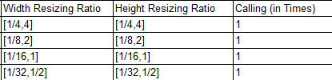

# Can I Change the Width and Height at the Same Time Using the Resize Function of the VPC Module?<a name="EN-US_TOPIC_0197711802"></a>

## Description<a name="section11162175131515"></a>

Can I use the resize function of the VPC module to change the image width and height at the same time?

## Solution<a name="section535801716158"></a>

If the image resizing ratio is within the range of width \[1/32,16\] and height \[1/32,16\], the width and height can be changed at a time. That is, the width and height can be scaled down to 1/32 times and scaled up to 16 times.

For the old VPC interfaces of the C10 version, the width and height resizing ranges are limited as follows.



If the width and height resizing ratios are not within these ranges, you are advised to upgrade C10 to C30. If the version upgrade is not supported, you can perform width resizing only and then height resizing.

For example, if the width resizing ratio is \[1/8,2\] and the height resizing ratio is \[2,4\], the width and height resizing operations cannot be performed at a time.

For an old VPC interface of C10, if the height scaling-up range is \[1/4.4\] and width scaling-down range is \[1/8,2\], the following error information is displayed.

```
[SetScalerInfoBranch:105] [L20] scaler fail. because hinc = outWidth(128)/cropWidth(44) =2.909091. vinc = outHeight(112)/cropHeight(524) = 0.213740. hinc and vinc must be in [0.03125,16]
```

