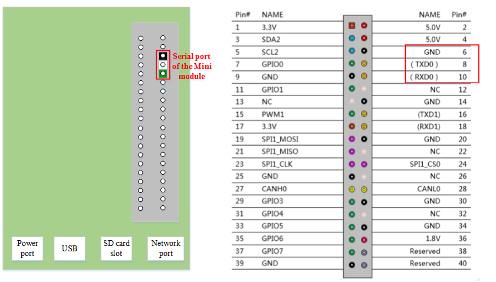
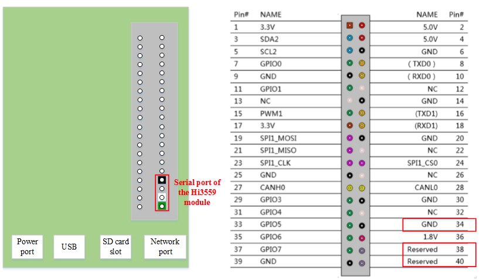

# Connecting the Atlas 200 DK Developer Board over a Serial Port

## Connecting to the Atlas 200 AI Accelerator Module over a Serial Port

You can view the startup information about the Atlas 200 AI accelerator module on the Atlas 200 DK developer board over a serial port. 

> **NOTE:**   
>This serial port is used only for viewing startup information. After the Atlas 200 AI accelerator module is started, the serial port is disabled, and the Atlas 200 AI accelerator module cannot be logged in to.  

[Figure 1](#en-us_topic_0177457236_fig43088819710)  shows how to connect to the Atlas 200 AI accelerator module by using a serial cable.

**Figure  1**  Serial port connection of the Atlas 200 AI accelerator module  

Serial port on the Atlas 200 AI accelerator module: Connect a cable to the serial port according to the colors specified in  [Figure 1](#en-us_topic_0177457236_fig43088819710).

Requirements for the serial cable: USB-to-serial cable \(3.3 V\)

## Connecting to the Hi3559 Module over a Serial Port

The Atlas 200 DK developer board provides a serial port for connecting to the Hi3559 module.  [Figure 2](#en-us_topic_0177457236_fig10518342175510)  shows the serial port connection diagram.

**Figure  2**  Hi3559 serial port connection  

Connect the serial cable to the Hi3559 serial port according to the colors specified in  [Figure 2](#en-us_topic_0177457236_fig10518342175510).

Requirements for the serial cable: USB-to-serial cable \(3.3 V\)

