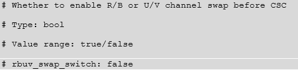
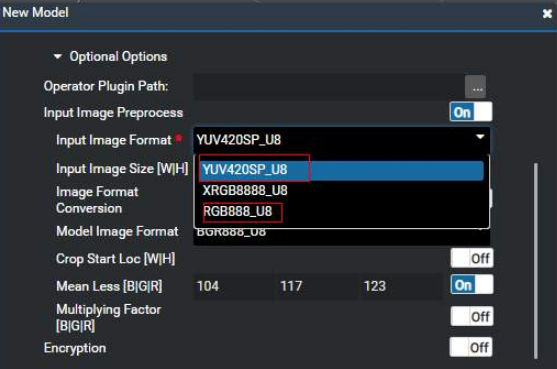
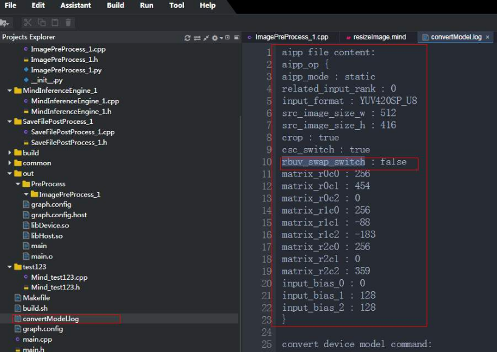

# How Can I Convert Data in NV21 Format to Data in NV12 Format?

## Description

The DVPP JPG decoding generates NV21 data in YUV420SP format. How do I convert the generate data to NV12 data in YUV420SP format?

## Cause Analysis

AIPP supports the input of NV21 images in YUV420SP format. To convert NV21 images to NV12 images, you can configure  **rbuv\_swap\_switch**  in the AIPP configuration file to implement channel switching.

Change  **rbuv\_swap\_switch: false**  to  **rbuv\_swap\_switch: true**.

## Solution

The AIPP parameter is set during model conversion. On the Mind Studio model conversion page, the AIPP parameter supports the input picture formats YUV420SP\_u8 \(NV12\) and RGB888\_U8 \(RGB\), as shown in the following figure. The NV21 input format is not supported.

To support NV21 or BGR, you need to convert the model through the command line interface \(CLI\).

1.  To simplify the configuration of the AIPP configuration file in the CLI, save the AIPP configuration file from Mind Studio. Use Mind Studio to convert the model. The  **convertModel.log**  file contains the AIPP configuration, as shown in the following figure. Copy the information in the red box to a new file, and name the file  **aipp.cfg**.

    

    Change  **rbuv\_swap\_switch:false**  in the  **aipp.cfg**  file to  **rbuv\_swap\_switch:true**.

2.  Use the CLI for model conversion.

    For example:

    omg   --model=_resnet18.prototxt_  --weight=_ResNet-18-model.caffemodel_  --framework=0 --output=_resnet18_   --insert\_op\_conf=aipp.cfg

    For more parameters of the offline model generator \(OMG\), see the  **omg --help**  command.

    The  **--output**  parameter indicates the name of the output offline model. The output file is  **resnet.om**.

    Copy the .om file to the required directory.

