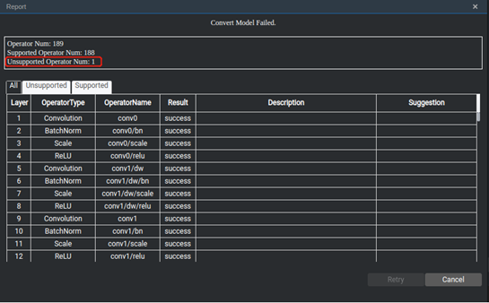
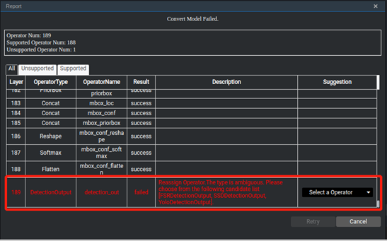

# How Do I Handle Unsupported Operators During SSD Caffe Model Conversion?

## Symptom

During SSD Caffe model conversion, a message is displayed indicating there is an unsupported operator, as shown in the following figure.

**Figure  1**  Message indicating an unsupported operator during model conversion  

## Solution

Check the unsupported operator at the bottom of the table, as shown in the following figure.

**Figure  2**  Viewing the unsupported operator  

The system prompts that the DetectionOutPut operator is not supported. In the  **Suggestion**  column on the right, select the DetectionOutput operator corresponding to the current network.

