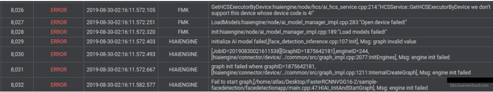
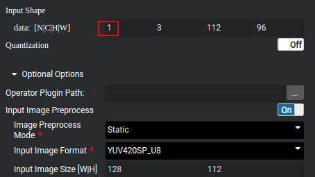
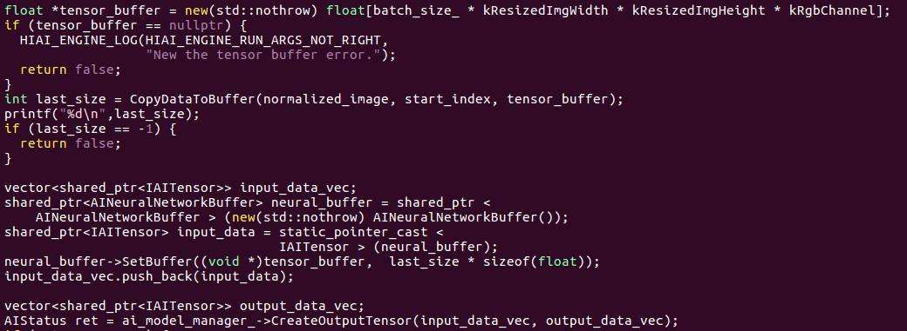

# How Do I Replace the Model File in the Application Example?

## Description

In the FaceDetection application example, after the model file is changed to  **fasterrcnn-vgg16**  and the corresponding input parameters are modified, an error is reported, indicating that the graph file fails to be generated.

The following shows details:

What does "HCSService::GetHC\*\*ecutorByDevice we don't support this device whose device code is 4!" mean? How do I solve this problem?

## Solution

1.  Ensure that the version of the \*.om model file is consistent with the  Mind Studio  version of the running application.  Mind Studio  models of different versions cannot be used together.
2.  Modify the  **graph\_deploy.config**  file in the code file. Replace the model file name in the file with your own model file name, and change the value of  **batch\_size**  to  **N**  in  **Input Shape**  set during model conversion, as shown in the following figure.

    **Figure  1**  Model conversion configuration  
    

3.  Copy the \*.om model file to the directory where the  **graph\_deploy.config**  file is located.
4.  Modify the model input part in the implementation code. The following figure uses facial recognition as an example.

    

    Determine the input size of the replacement model during model conversion, that is,  **C=kRgbChannel**,  **H=kResizeImgHeight**, and  **W=kResizeImgWidth**.

5.  Run the deployment and running scripts.

