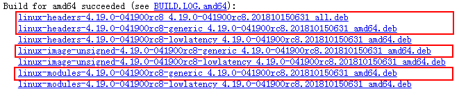

# How Do I Upgrade the Linux Kernel to Version 4.18?

Mind Studio  requires that the Linux kernel version must be 4.18 or later. Otherwise, the GUI may stop responding when the custom operator plug-in is loaded during model conversion.

The following describes how to upgrade the Linux kernel.

1.  Run the  **uname -a**  command to check whether the Ubuntu Linux kernel version is earlier than 4.18.
    -   If the version is later than 4.18, you do not need to upgrade the kernel.
    -   If the version is earlier than 4.18, go to the following steps.

2.  Download the Linux kernel.

    Download the Linux kernel from  [https://kernel.ubuntu.com/\~kernel-ppa/mainline/?C=N;O=D](https://kernel.ubuntu.com/~kernel-ppa/mainline/?C=N;O=D).

    The following uses the v4.18-rc8 version as an example. Files marked with red boxes in  [Figure 1](#fig1649616181275)  need to be downloaded.

    **Figure  1**  Kernel files to be downloaded  
    

    Right-click the software package and choose  **Copy link address**  from the shortcut menu. Then, run the  **wget**_ link address_  command as the  **root**  user on Ubuntu Server to download the corresponding file. For example:

    1.  Create a folder for storing kernel files as the  **root **user.

        For example:

        **su root**

        **mkdir \~/kernel\_v4.18**

        **cd \~/kernel\_v4.18**

    2.  Run the following commands to download the files:

        **wget  [https://kernel.ubuntu.com/\~kernel-ppa/mainline/v4.18-rc8/linux-headers-4.18.0-041800rc8\_4.18.0-041800rc8.201808052031\_all.deb](https://kernel.ubuntu.com/~kernel-ppa/mainline/v4.18-rc8/linux-headers-4.18.0-041800rc8_4.18.0-041800rc8.201808052031_all.deb)**

        **wget  [https://kernel.ubuntu.com/\~kernel-ppa/mainline/v4.18-rc8/linux-headers-4.18.0-041800rc8-generic\_4.18.0-041800rc8.201808052031\_amd64.deb](https://kernel.ubuntu.com/~kernel-ppa/mainline/v4.18-rc8/linux-headers-4.18.0-041800rc8-generic_4.18.0-041800rc8.201808052031_amd64.deb)**

        **wget  [https://kernel.ubuntu.com/\~kernel-ppa/mainline/v4.18-rc8/linux-image-unsigned-4.18.0-041800rc8-generic\_4.18.0-041800rc8.201808052031\_amd64.deb](https://kernel.ubuntu.com/~kernel-ppa/mainline/v4.18-rc8/linux-image-unsigned-4.18.0-041800rc8-generic_4.18.0-041800rc8.201808052031_amd64.deb)**

        **wget  [https://kernel.ubuntu.com/\~kernel-ppa/mainline/v4.18-rc8/linux-modules-4.18.0-041800rc8-generic\_4.18.0-041800rc8.201808052031\_amd64.deb](https://kernel.ubuntu.com/~kernel-ppa/mainline/v4.18-rc8/linux-modules-4.18.0-041800rc8-generic_4.18.0-041800rc8.201808052031_amd64.deb)**

    3.  Run the  **dpkg**  command in the current directory to install the downloaded kernel files.

        **dkpg -i \*.deb**

        -   If a dependency is missing during the command execution, run the** apt-get install -f **command to automatically install the missing dependency.
        -   If the error message "libssl1.1.0\(\>=1.1.0\)" is still displayed after the preceding command is executed, download the file from the following link to any directory on Ubuntu Server:

            [https://bbs.huaweicloud.com/forum/thread-22441-1-1.html](https://bbs.huaweicloud.com/forum/thread-22441-1-1.html)

            Decompress the  **libssl1.1\_1.1.0g-2ubuntu4.1\_amd64.deb**  package and run the following command as the  **root **user to manually install libssll.1.1.0:

            **dkpg libssl1.1\_1.1.0g-2ubuntu4.1\_amd64.deb**

            Then, go to the  **\~/kernel\_v4.18**  directory for kernel installation.

    4.  After the kernel is installed, run the  **reboot**  command to restart the system.

        Then, run the  **uname -a**  command to check whether the kernel version is 4.18.

