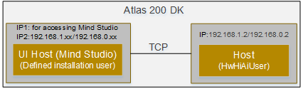
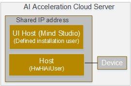

# How Do I Upload Files to the Host?

-   For the Atlas 200 DK, the default IP address of the developer board \(host\) is  **192.168.1.2**  in USB connection mode or  **192.168.0.2**  in NIC connection mode.  Mind Studio  \(UI Host\) usually has two IP addresses. One is for accessing the  Mind Studio  web page and the other is in the same network segment as the developer board for communicating with it, as shown in  [Figure 1](#en-us_topic_0182554630_fig952311453521).

    The running user of  Mind Studio  is a custom  Mind Studio  installation user, while the running user of Host is  **HwHiAiUser**.

    **Figure  1**  Example connection between UI Host and Host in the Atlas 200 DK  
    

-   In the AI acceleration cloud server,  Mind Studio  \(UI Host\) and Host are deployed on the same server, with the same access IP address but different running users. The running user of  Mind Studio  is a custom  Mind Studio  installation user, while the running user of Host is  **HwHiAiUser**.

    **Figure  2**  Example connection between UI Host to Host in the AI acceleration cloud server  
    

You can run the  **scp**  command to upload a file from UI Host to Host. The following is an example:

Run the following command on UI Host:

**scp  _/filepath/filename_  HwHiAiUser@_host\_ip_:/home/HwHiAiUser/_filepath_**

For example, copy the  **/home/ascend/car.mp4**  file on UI Host to  **/home/HwHiAiUser/sample**  on Host.

**scp /home/ascend/car.mp4 HwHiAiUser@192.168.1.2:/home/HwHiAiUser/sample**

