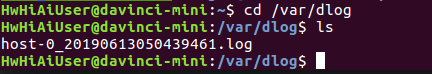
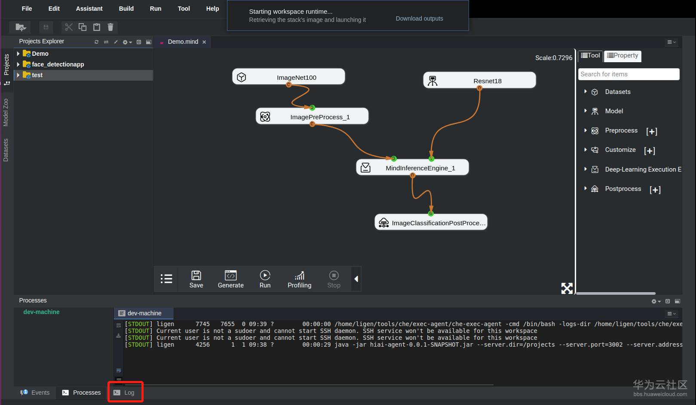
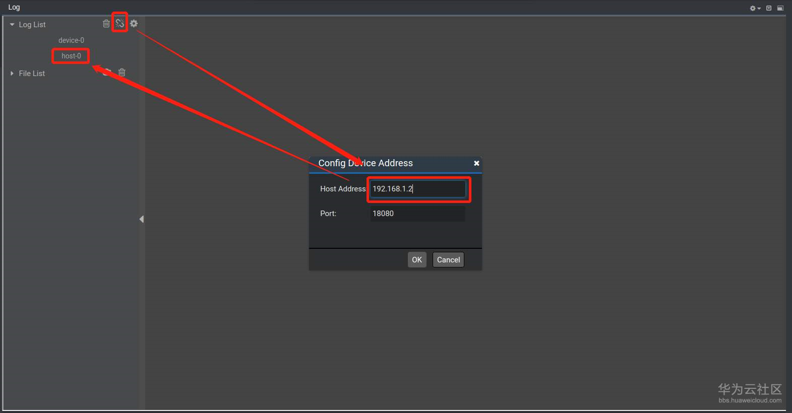
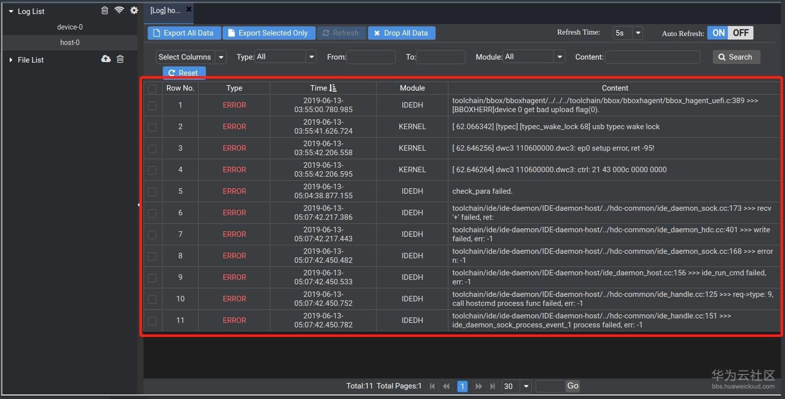
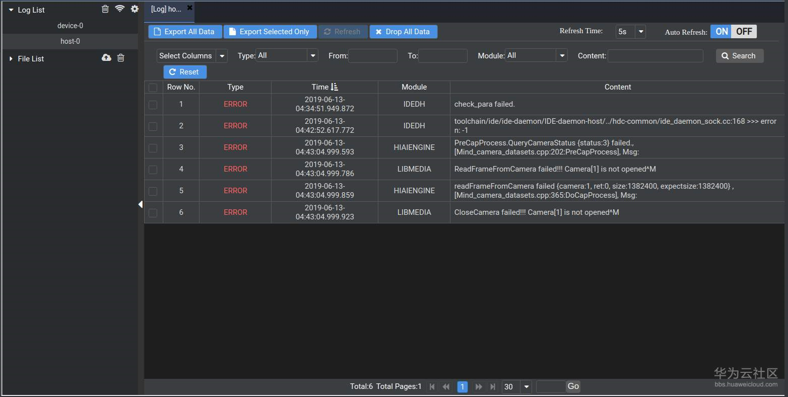

# How Do I View Logs of Apps Running on the Developer Board?

## Context

If an error occurs when a demo app obtained from GitHub is run, it is not helpful to locate the fault by checking logs on the terminal. You should view the logs printed on the developer board.

## Procedure

1.  Log in to the Atlas 200 DK developer board in SSH mode. The log files named after timestamps and saved in the** /var/dlog/**  directory, as shown in the following figure.

    

    However, the log files can not be read directly. You need to parse the log files using  Mind Studio.

2.  Log in to  Mind Studio  and click the  **Log **tab in the lower left corner.

    

3.  Click the connection icon next to  **Log List**  in the upper left corner, enter the IP address of the developer board in the dialog box that is displayed, and click  **host-0**  to view all error logs of the developer board.

    

    The following figure shows a log example.

    

    The error logs of all apps recorded by the developer board are stored in this file. Each time an error occurs, the log is appended to the end of the file. Therefore, if there are too many logs to check, you can log in to the developer board and run the following command to clear the existing logs:

    **rm /var/dlog/\***

    Run the app again to reproduce the fault. Then log in to  Mind Studio  again to view the log of this fault.

    As shown in the following figure, an error message is displayed when the face detection app is running. The log shows that camera channel 2 is faulty \(**Camera\[1\]**  corresponds to channel 2 and  **Camera\[0\]**  corresponds to channel 1\). Check the camera channel configuration.

    

