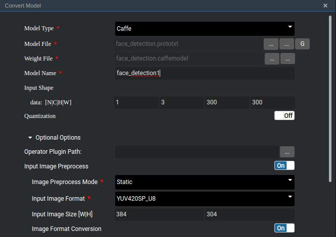
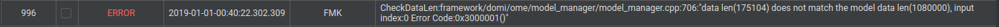

# Is the Model File 128\*16 \(W\*H\) Aligned During Model Conversion?

## Description

For example, for a face detection model, if only  **1, 3, 300, 300**  is set for model conversion, do I need to align the width and height by bits?

## Solution

During model conversion, AIPP is enabled by default. Expand  **Optional Options**. The following parameters are displayed:

**Figure  1**  AIPP configuration  

The input image is 128\*16 \(W\*H\) aligned.

If  **Input Image Preprocess**  is disabled, the following error message is displayed when you run the face detection program:

In this case, the data length required by the model is 1\*3\*300\*300\*4 \(float type\) = 1080000, but the data length sent by the face detection sample code to the inference engine is 384\*304\*1.5 \(YUV\) = 175104. The two lengths do not match, so the inference fails.

