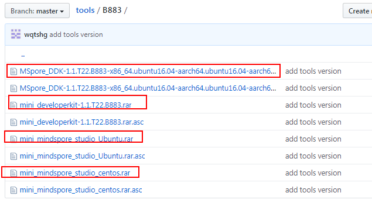
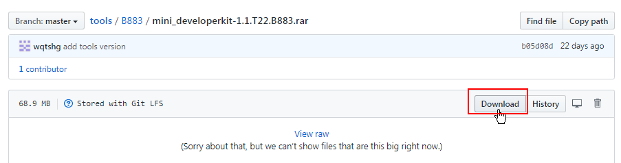

# Precautions for Downloading Software Packages from GitHub

When downloading software packages from the GitHub, do not clone the whole repository, which is slow and the software packages downloaded may be incomplete.

You are advised to download the .rar software packages one by one, as shown in the following figure.

Click  **XXX.rar**. On the page that is displayed, click  **Download **to download the software package.

