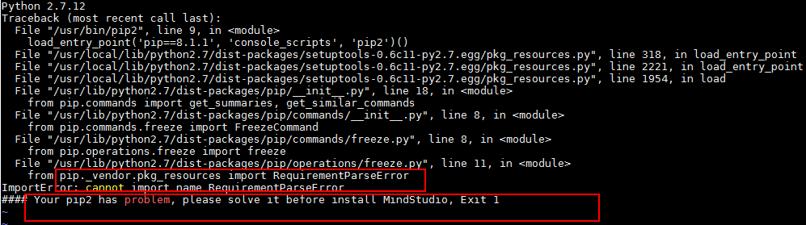
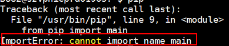

# What Do I Do If a Message Is Displayed Indicating pip2 or pip Unavailability During  Mind Studio  or DDK Installation?<a name="EN-US_TOPIC_0196221391"></a>

## Symptom<a name="en-us_topic_0175307513_en-us_topic_0175013079_en-us_topic_0171650677_section176451928114716"></a>

During the installation of  Mind Studio  or a DDK, the system displays a message indicating that the pip2 or pip is unavailable and exits the installation, as shown in  [Figure 1](#en-us_topic_0175307513_en-us_topic_0175013079_en-us_topic_0171650677_fig177764114566)  and  [Figure 2](#en-us_topic_0175307513_en-us_topic_0175013079_fig10609155213913).

**Figure  1**  Message indicating pip2 unavailability<a name="en-us_topic_0175307513_en-us_topic_0175013079_en-us_topic_0171650677_fig177764114566"></a>  


**Figure  2**  Message indicating pip unavailability<a name="en-us_topic_0175307513_en-us_topic_0175013079_fig10609155213913"></a>  


## Possible Cause<a name="en-us_topic_0175307513_en-us_topic_0175013079_en-us_topic_0171650677_section1763311253579"></a>

pip2 is not updated during pip re-installation.

## Solution 1<a name="en-us_topic_0175307513_en-us_topic_0175013079_en-us_topic_0171650677_section15451153411471"></a>

1.  Run the  **su root**  command to switch to the root user and run the  **pip list**  command. If no error message is displayed, the pip is available. If an error message is displayed after the  **pip2 list**  command is executed, the pip2 is unavailable.
2.  Run the  **rm /usr/bin/pip2**  command as the root user to delete the pip2.
3.  Run the  **ln -s pip pip2**  command to soft link the pip2 to pip.
4.  Run the  **pip2 list**  command again. If no error message is displayed, it indicates that the fault has been rectified.

    If the pip and pip2 are still unavailable, see  [Solution 2](#en-us_topic_0175307513_en-us_topic_0175013079_section1327433113).


## **Solution 2**<a name="en-us_topic_0175307513_en-us_topic_0175013079_section1327433113"></a>

If the pip installation is abnormal during the dependency installation, run the following commands in sequence:

```
sudo apt-get remove python-pip python3-pip
wget https://bootstrap.pypa.io/get-pip.py
python get-pip.py --user
python3 get-pip.py  --user
```

