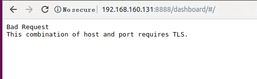

# What Do I Do If an Error Message Is Displayed Indicating an Incorrect IP Address after  Mind Studio  Is Installed?

## Symptom

After  Mind Studio  is installed, the following error message is displayed during login:

**Figure  1** Mind Studio  login error page  

## Solution

Check the IP address configuration because the connection is abnormal. It is found that the IP address configuration is correct. It is found that  **https://**  is not entered during login. This situation is the same as the default input  **http://**, both of which cannot be identified.

Log in to the system at https://\*\*\*\*:8888/dashboard/\#/. The login is successful.

