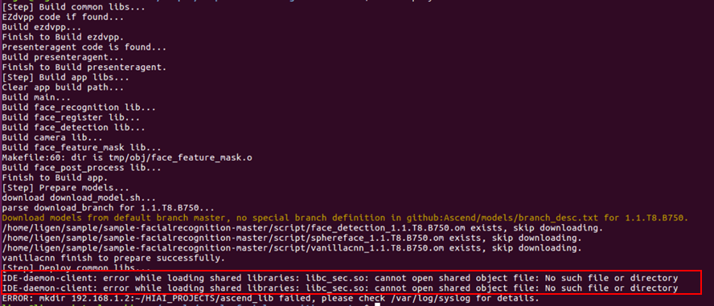
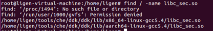

# What Do I Do If an Error Occurs in the deploy.sh Script During the Deployment of the Facial Recognition Application?

## Symptom

During the deployment of the face recognition application, the following message is displayed in the execution of the  **deploy.sh**  script:  IDE-daemon-client: error while loading shared libraries: lib\_sec.so: cannot open shared object file: No such file or directory.

**Figure  1** **deploy.sh**  execution failure during facial recognition application deployment  

## Solution

1.  Search for the  **lib\_sec.so**  file in the current system, as shown in the following figure.

    **Figure  2**  Searching for the lib\_sec.so file on the  Mind Studio  server  
    

    As shown in the preceding figure, the file exists in  **$HOME/tools/che/ddk/ddk/lib**.

    The file exists but cannot be found by the app. Therefore, it is inferred that the environment variable is not set.

2.  Set the following environment variables in  **\~/.bashrc**:

    export DDK\_HOME=$HOME/tools/che/ddk/ddk

    export LD\_LIBRARY\_PATH=$DDK\_HOME/uihost/lib

