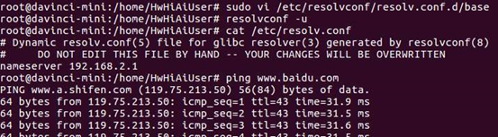

# What Do I Do If an IP Address Rather than a Domain Name Can Be Pinged on the Developer Board?

## Symptom

On the developer board, an IP address can be pinged, while a domain name cannot be pinged.

## Solution

The possible cause is that the DNS address fails to be automatically obtained, leading to the DNS resolution failure.

To resolve this problem, perform the following operations:

1.  Query the IP address of the DNS server on a LAN in Windows.
2.  Change the value of  **namesever**  in the  **/etc/resolv.conf**  file to the address queried in  [1](#li567181713719).

    

