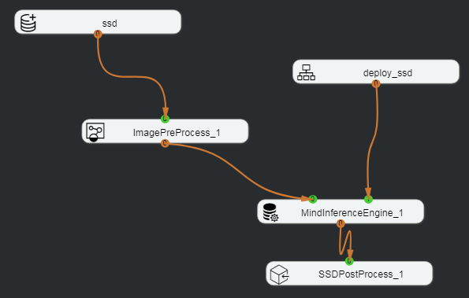
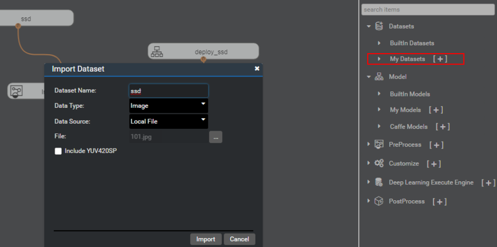
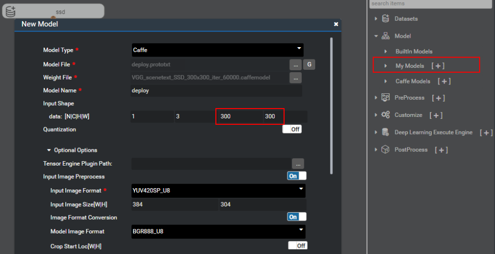
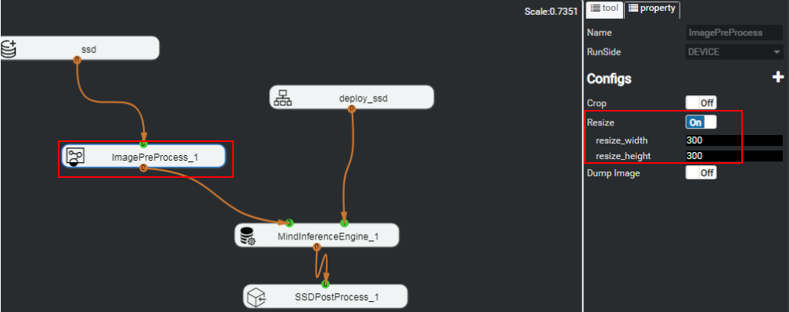

# What Do I Do If No Running Result Is Displayed When the SSD Network Model Is Used to Execute the Detector App?

## Symptom

When the trained SSD detector app is used to recognize texts in various scenarios, the model can be imported successfully, but the output cannot be viewed on the post-processing node.

[Figure 1](#fig43062011114910)  shows the orchestration process.

**Figure  1**  Detector orchestration process  

## Solution

Ensure that the process orchestration engine is correctly deployed. Check key configurations when the project type is correct and the network connection is normal.

-   SSD is the dataset with  **Data Type**  of  **Image**  imported in  **My Datasets**, as shown in  [Figure 2](#fig51871639165810).

    **Figure  2**  Dataset import  
    

-   depoy\_ssd is the model imported in  **My Models**, as shown in  [Figure 3](#fig32801913104).

    **Figure  3**  Importing the SSD network model  
    

    The required height and width of the input image are 300 x 300.

-   Change the  **Resize**  value of the ImagePreProcess node to be the same as that required by the model, as shown in  [Figure 4](#fig1199017311324).

    **Figure  4**  Configuring the ImagePreProcess node  
    

After the preceding configurations are correct, run the orchestration process again. Right-click  **SSDPostProcess**  and choose  **image result**  from the shortcut menu to view the image processing result.

