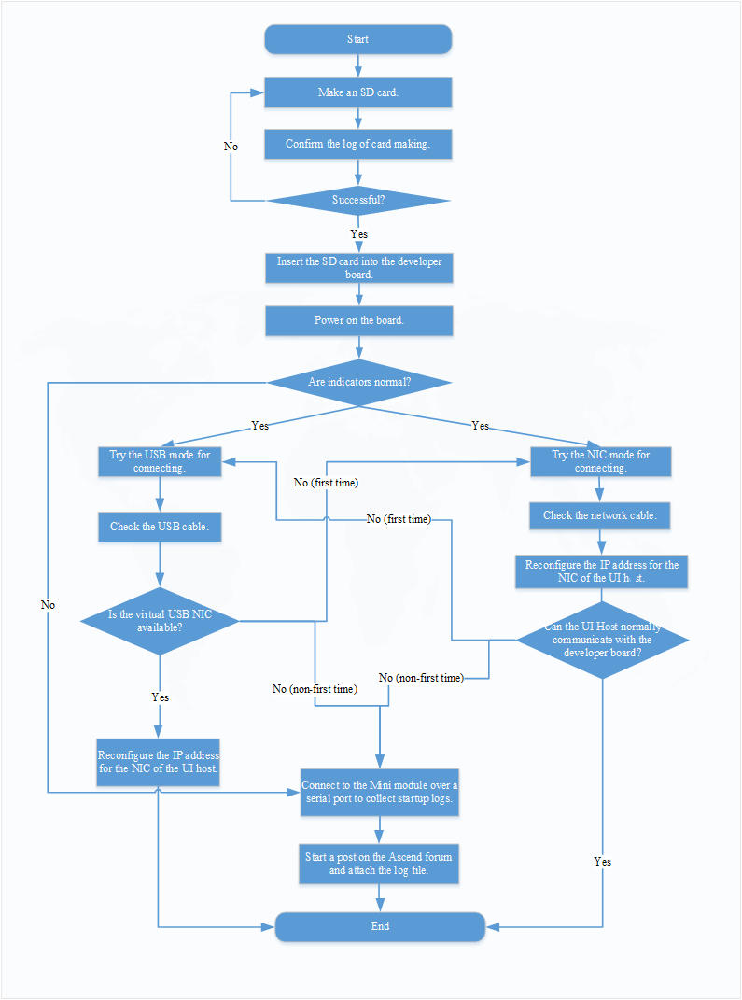
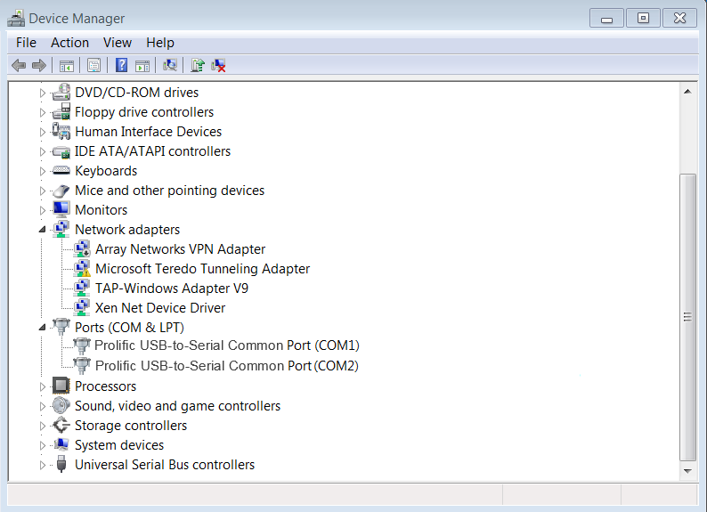

# What Do I Do If the Developer Board Cannot Connect to the UI Host?

## Symptom

The symptoms are as follows:

-   After a prepared SD card is inserted into the developer board and the developer board is powered on, the LED1 and LED2 indicators on the developer board are abnormal.
-   After a prepared SD card is inserted into the developer board, the developer board is connected to the UI host in USB mode, and the developer board is powered on and started, no virtual NIC information is displayed on the UI host.
-   After a prepared SD card is inserted into the developer board, the developer board is connected to the UI host in NIC mode, the developer board is powered on and started, and the NIC information of the UI host is configured, the UI host fails to communicate with the developer board.

## **Fault Locating**

Perform troubleshooting by referring to  [Figure 1](#en-us_topic_0180794569_fig1981101653313).

**Figure  1**  Troubleshooting process  

## Solution

1.  Ensure that the SD card is made correctly and successfully.

    In the  **sd\_card\_making\_log**  file in the directory where the card creation scripts are located, check whether the card is made successfully. If the card fails to be created, try again.

2.  Insert the SD card into the Atlas 200 DK developer board and power on the board.
    -   If LED1 and LED2 on the Atlas 200 DK developer board are normal, that is, LDE1 and LDE2 are both on after the developer board is started, go to  [3](#en-us_topic_0180794569_li16493313517).
    -   If LED1 and LED2 on the Atlas 200 DK developer board are abnormal, that is, LED1 and LED2 are not on after the developer board is started for a long time \(more than 15 minutes\), go to  [4](#en-us_topic_0180794569_li16812121181314).

3.  Connect the Atlas 200 DK developer board to the UI host.

    -   The UI host is connected to the developer board in USB mode, but the virtual USB NIC is not displayed on the UI host.

        Check the USB network cable and ensure that both ends of the USB network cable are properly connected.

        If the USB virtual NIC is still not displayed on the UI host, try using the NIC mode to connect the UI host to the developer board.

    -   The UI host is connected to the developer board in NIC mode. The UI host fails to communicate with the developer board after the IP address is configured for the NIC of the UI host.

        Check the network cable and ensure that the two connected ports of the network cable are normal, and the reconfigure the IP address of the NIC on the UI host.

        If the UI host still fails to communicate with the developer board, try using the USB mode to connect the UI host to the developer board.

    If the UI host fails to connect to the developer board in either USB or NIC mode, go to  [4](#en-us_topic_0180794569_li16812121181314).

4.  Connect the Atlas 200 AI accelerator module of the Atlas 200 DK developer board to the UI host over a serial cable by referring to  [Connecting the Atlas 200 DK Developer Board over a Serial Port](connecting-the-atlas-200-dk-developer-board-over-a-serial-port.md).
5.  Install the network debugging tool and USB-to-serial driver on the UI host.
    -   Recommended network debugging tool: IPOP
    -   USB-to-serial driver: PL2303 driver

6.  Start the network project debugging tool, for example, IPOP. The serial port window is displayed.
    1.  Click the  **Terminal**  tab page.
    2.  On the menu bar, click  . The  **Connect List**  dialog box is displayed.
    3.  Configure the connection.
        -   **ConnName**: indicates a user-defined connection name.
        -   **Type**: indicates a port type. Choose  **COMX**. You can view the available COM ports in the device manager of the computer. Remove and insert the serial cable on the UI host to determine the COM port used by the Atlas 200 DK, as shown in  [Figure 2](#en-us_topic_0180794569_fig164311304117).

            **Figure  2**  Viewing COM ports  
            

        -   Set the baud rate to  **115200**.

    4.  Click  **OK**.

7.  Power on the Atlas 200 DK developer board, and view the Atlas 200 DK startup information in the COM connection window of the IPOP tool.

    There are many startup logs. Click    on the menu bar to save the startup logs to the installation directory of the IPOP tool. When this button changes to  , a message is displayed at the bottom of the IPOP tool, indicating that the log file is saved. You can obtain the log file named after the current time from the installation directory of the IPOP tool according to the message.

8.  Start a help post on the  [Ascend Forum](https://bbs.huaweicloud.com/forum/forum-726-1.html)  and upload the startup log file as an attachment. Huawei engineers will answer your question as soon as possible.

