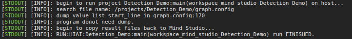
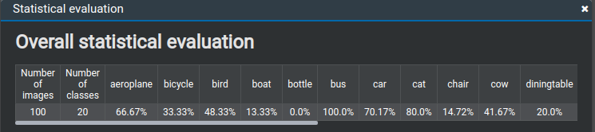
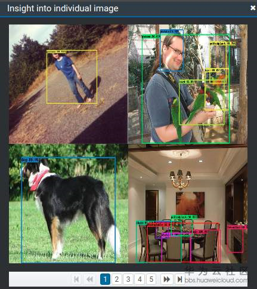
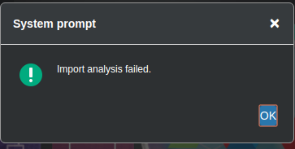
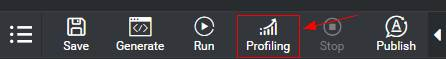

# What Do I Do If the Error Import analysis failed" Is Reported When Profiling Is Executed in  Mind Studio?

## Symptom

Run the app of the fast\_rcnn\_vgg16 network. A message is displayed, indicating that the operation is successful.

Right-click the post-processing node and choose  **Statistical Result**  and  **Image Result**  respectively from the shortcut menu to view the results, as shown in the following figure.

Right-click the post-processing node and choose  **Profiling **from the shortcut menu, an error message is displayed, as shown in the following figure.

## Solution

Before viewing the Profiling analysis result of the post-processing node, you need to run Profiling, as shown in the following figure.

Right-click the post-processing node and choose  **Profiling **from the shortcut menu to view the result.

