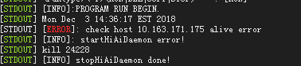

# What Do I Do If the Error Message"alive error" Is Displayed When Running a Sample?

## Symptom

If  Mind Studio  and the host are not on the same PC, the following error message is displayed after  **Run**  is clicked to execute an app.

## Cause Analysis

IDE-daemon listens to the static IP address during startup. If the IP address is not set,  Mind Studio  cannot run an app.

## Solution

Run the  **sudo vi /etc/network/interfaces**  command in the system IP configuration file to set the IP address of the host to a static IP address, as shown in the following figure.

