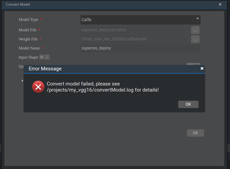
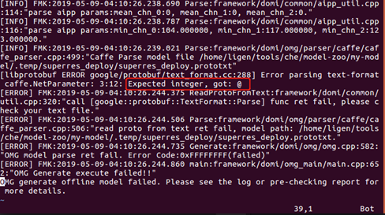
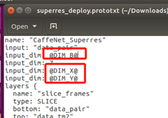

# What Do I Do If the Error Message "Error parsing text-format..." Is Displayed During Model Conversion?

## Description

During model conversion, the error information shown in the following figure is displayed.

**Figure  1**  Model conversion failure  

The  **convertModel.log**  file reports the following error.

**Figure  2**  Model conversion log  

## Solution

According to the log, it is inferred that the data in the model should be an integer, but the actual input is a character with the symbol  **@**. Check the model file. It is found that the defined dimension parameters are incorrect, as shown in the following figure.

**Figure  3**  Definition of model file dimensions  

Change the dimensions in the model file to the correct dimensions.

