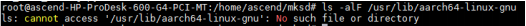
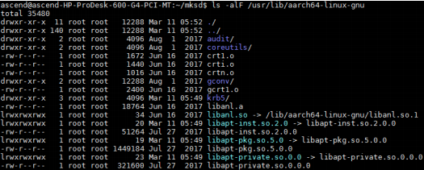

# What Do I Do If the Error Message "has no exec file" Is Displayed During the Running of the Demo App "General Classification Network"?

## Symptom

During the execution of the general classification network app according to the guide, the error message "has no exec file" is displayed.

## Solution

Run the following command on the server where  Mind Studio  is located to check the deployed cross compilation environment:

**ls -alF /usr/lib/aarch64-linux-gnu**

The information shown in the following figure indicates that the  Mind Studio  server is not configured with a cross compilation environment.

**Figure  1**  Lack of the cross compilation environment configuration  

Configure the cross compilation environment by referring to  **Configuring the UI Host Cross Compilation Environment**  in  _Ascend 310 Atlas 200 Developer Kit User Guide_.

The following figure shows the command output when the cross compilation environment has been configured.

**Figure  2**  Command output showing the configured cross compilation environment  

