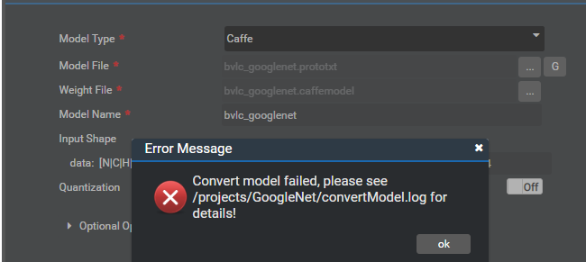

# What Do I Do If the Error Message "It is recommended to convert layers-structure to layer-structure by caffe tool" Is Displayed During Model Conversion?<a name="EN-US_TOPIC_0196221410"></a>

## Description<a name="section1094753316415"></a>

The .prototxt and .caffemodel files of GoogleNet downloaded from https://github.com/BVLC/caffe/tree/master/models/bvlc\_googlenet fail to be imported, as shown in  [Figure 1](#fig1228161315813).

**Figure  1**  Model conversion failure<a name="fig1228161315813"></a>  


The  **convertModel.log**  file reports the following error:

```
[ERROR] FMK:2018-12-22-23:47:48.147.318 ConvertNetParameter:framework/domi/omg/parser/caffe/caffe_parser.cpp:776:"The weight file is consisted of layers-structure which is deprecated in caffe and unsupport in OMG. It is recommended to convert layers-structure to layer-structure by caffe tool. Error Code:0xFFFFFFFF(failed)"
```

## Solution<a name="section84443381948"></a>

The cause is the .prototxt and .caffemodel files have to be upgraded to the latest by using tools provided by Caffe. You can obtain the Caffe tools from  [Link](https://github.com/BVLC/caffe).

1.  Download the upgrade\_net\_proto\_text and upgrade\_net\_proto\_binary tools to any directory on the  Mind Studio  server.
2.  Use the upgrade\_net\_proto\_text tool to upgrade the .prototxt file.

    **upgrade\_net\_proto\_text** _model\_old.prototxt_ _model\_new.prototxt_

3.  Use the upgrade\_net\_proto\_binary tool to upgrade the .caffemodel file.

    **upgrade\_net\_proto\_binary** _model\_old.caffemodel_ _model.new.caffemodel_

4.  Use the upgraded .protoxt file and .caffemodel file to import the models again.

