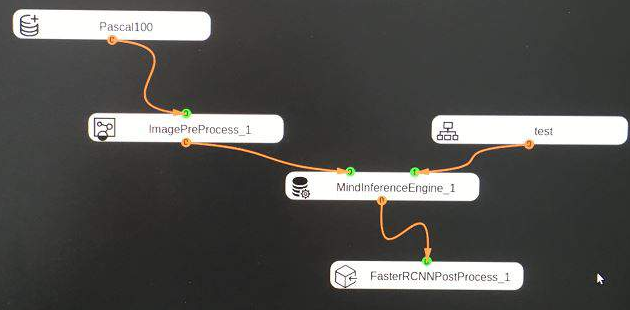
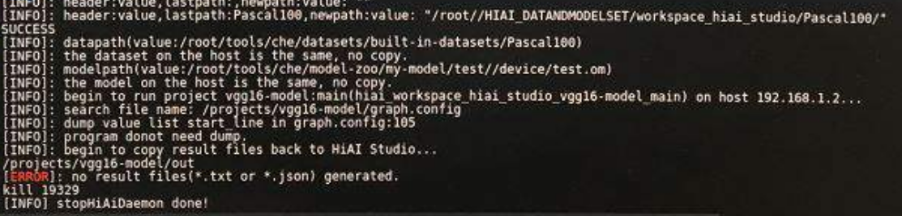
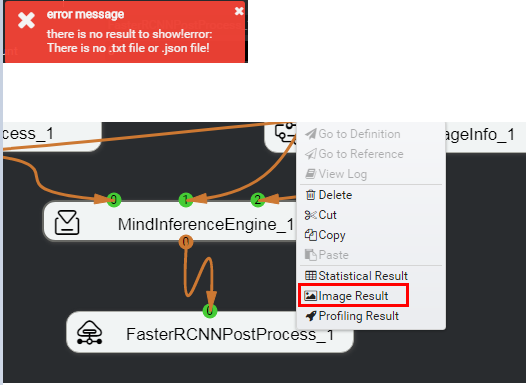
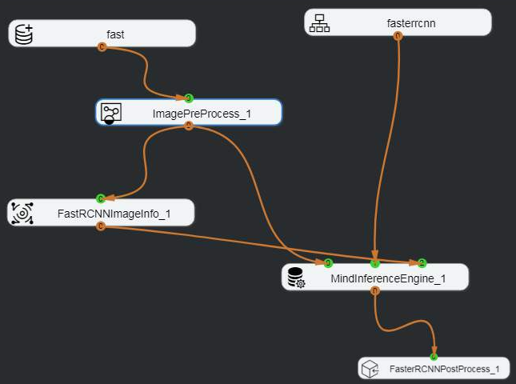
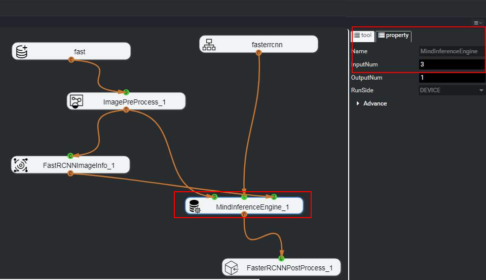
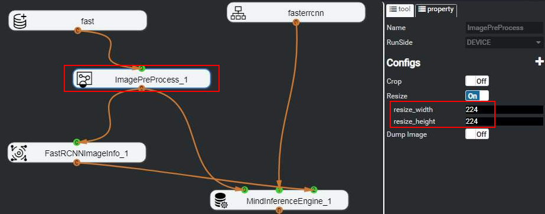

# What Do I Do If the Error Message "no result file" Is Displayed When Object Detection Is Executed by Using the Fast R-CNN Network Model?

## Symptom

The object detection model Faster-R-CNN is successfully imported using the model import function of  Mind Studio.

The Faster-R-CNN network is used for orchestration, as shown in  [Figure 1](#fig10831175535111).

**Figure  1**  Object detection implementation process  

The error information shown in  [Figure 2](#fig770617315556)  is displayed during app running.

**Figure  2**  Object detection implementation process  

Alternatively, right-click the  **FasterRCNNPostProcess**  node and choose  **Image Result**  from the shortcut menu after the programming running is complete. The error shown in  [Figure 3](#fig554375294413)  is displayed.

**Figure  3**  Error displayed in process orchestration  

## Solution

-   Problem 1: The process orchestration is incorrect.

    Orchestrate the object detection process according to  [Figure 4](#fig1887122851).

    **Figure  4**  Object detection network orchestration process  
    

    The default number of input ports is  **2**  for MindInferenceEngine. Therefore, the value of  **InputNum**  has to be changed to  **3**. For details, see  [Figure 5](#fig97471244181417).

    **Figure  5**  InputNum setting of the MindInferenceEngine node  
    

    FaseRCNNImageInfo is a built-in engine of  Mind Studio, which processes pictures only from the Faster R-CNN network, which serves as the third input of MindInferenceEngine.

-   Problem 2: The resize attribute value of the image pre-processing node is incorrect, which is not set based on the width and height required by the model.
    1.  Check the width and height of the model. For details, see  [1](what-do-i-do-if-the-inference-result-is-incorrect-when-the-semantic-segmentation-process-is-executed.md#li19390134084114).
    2.  Set width and height of the  **Resize**  attribute of the ImagePreProcess node to the required width and height, as shown in  [Figure 6](#fig19617183519183).

        **Figure  6**  Setting the Resize attribute of the ImagePreprocess node  
        

