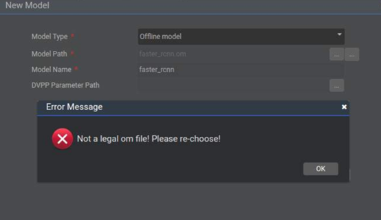

# What Do I Do If the Error Message "Not a legal om file" Is Displayed During the Import of a Local Da Vinci Model File?

## Description

A user selects  **Offline Model**  for  **Model Type**  in  **Tool \> Convert Model**  and imports a local converted Da Vinci model file. However, the following error message is displayed.

**Figure  1**  Failure to import the Da Vinci model file  

## Solution

Model files downloaded from the Git or SVN are compressed by default. Therefore, check whether the downloaded \*.om file is correctly downloaded and whether the size of the file is the same as the size of the original file.

