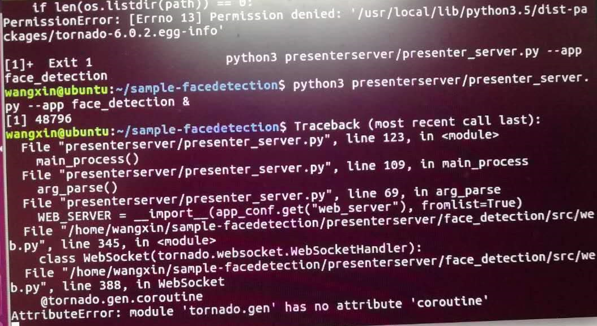

# What Do I Do If the Error Message "Permission denied:xxx/tornado-6.0.2.egg-info" Is Displayed When the Presenter Server Is Started?

## Symptom

When the presenter server service is started, the message "Permission denied: '/usr/local/lib/python3.5/dist-packages/tornado-6.0.2.egg-info" is displayed, as shown in the following figure.

**Figure  1**  Error reported during the start of the Presenter Server service  

## Solution

According to the error information, the installed version of the tornado library is 6.0.2. In this version,  **tornado.gen**  does not have the  **coroutine**  attribute. It is suspected that the installed version is incorrect. Compared with the tornado library installed in Ubuntu where the presenter server can be properly started, it is found that tornado library 5.1 should be installed.

Therefore, run the following commands to uninstall the original tornado library and install the 5.1 version respectively:

**pip3 uninstall tornado**

**Pip3 install tornado==5.1**

