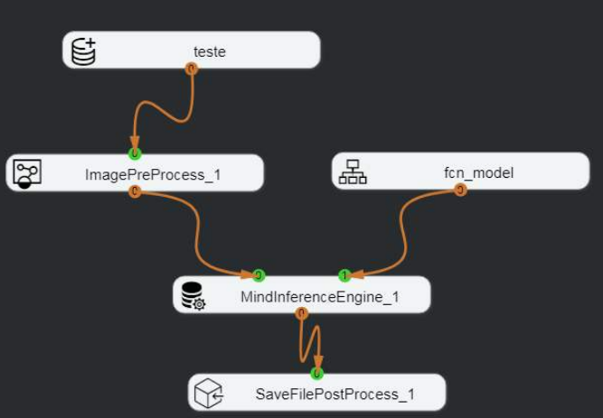
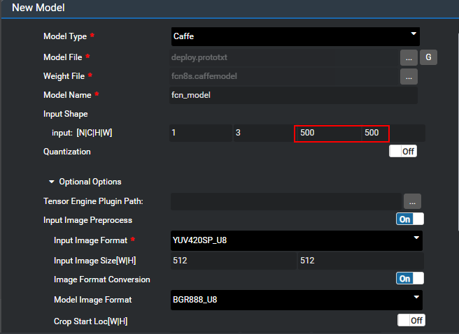

# What Do I Do If the Inference Result Is Incorrect When the Semantic Segmentation Process Is Executed by Using the FCN8s Model?<a name="EN-US_TOPIC_0196221387"></a>

## Symptom<a name="section5356258121619"></a>

The FCN network model is successfully imported by using the model import function of  Mind Studio.

After the following inference process is executed, a log is generated, indicating that the execution is successful. However, the model inference result is 0, and the output result is incorrect.  [Figure 1](#fig1221154313211)  shows the inference process. 

**Figure  1**  Semantic segmentation implementation process<a name="fig1221154313211"></a>  


## Solution<a name="section239142111720"></a>

The reason for the inference failure is that the resize attribute of the image preprocessing node ImagePreProcess is set incorrectly. The resize attribute needs to be set to the height and width required by the network model.

1.  <a name="li19390134084114"></a>Check the height and width required by the model.

    You can use either of the following methods to view the required image size of the network model:

    -   When importing a network model to  Mind Studio, obtain the height and width required by the model based on the parameters listed in  [Figure 2](#fig156634962714).

        **Figure  2**  Model import example<a name="fig156634962714"></a>  
        

        The values of  **H**  and  **W**  shown in the preceding figure are the required height and width of the image to be processed by the imported model.

    -   Check the  **input\_param**  parameter in the .prototxt file of the network model.

        ```
        layer {
          name: "input"
          type: "Input"
          top: "data"
          input_param {
            # These dimensions are purely for sake of example;
            # see infer.py for how to reshape the net to the given input size.
            shape { dim: 1 dim: 3 dim: 500 dim: 500 }
          }
        }
        ```

        In the preceding information, the last two parameters of  **shape**  in  **input\_param**  are the height and width required by the model, respectively.

2.  Set the resize attribute of the image pre-processing node.

    Set width and height of the  **Resize**  attribute of the ImagePreProcess node to the width and height in  [1](#li19390134084114)  respectively.

    


