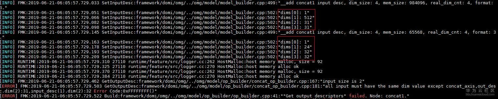

# What Do I Do If the Message "all input must have the same dim value" Is Displayed During Model Conversion?<a name="EN-US_TOPIC_0196221401"></a>

## Description<a name="section26671209549"></a>

The Caffe model fails to be converted. The error information is as follows:

```
[ERROR] FMK:2019-06-21-06:05:57.729.503 GetOutputDesc:framework/domi/omg/../omg/model/op_builder/concat_op_builder.cpp:181:"all input must have the same dim value except concat_axis,out_desc.dim(2):31,input_desc(1).dim(2):32 Error Code:0xFFFFFFFF()"
[ERROR] FMK:2019-06-21-06:05:57.729.522 Build:framework/domi/omg/../omg/model/op_builder/op_builder.cpp:41:""Get output descriptors" failed. Node: concat1."
[ERROR] FMK:2019-06-21-06:05:57.729.536 SetInputOutputDesc:framework/domi/omg/../omg/model/model_builder.cpp:594:"Op build failed. Node: concat1."
[ERROR] FMK:2019-06-21-06:05:57.729.555 Build:framework/domi/omg/../omg/model/model_builder.cpp:2868:"SetInputOutputDesc Failed!"
[ERROR] FMK:2019-06-21-06:05:57.729.568 Generate:framework/domi/omg/omg.cpp:800:"OMG builder Build() return fail."
[ERROR] FMK:2019-06-21-06:05:57.732.193 main:framework/domi/omg_main/main.cpp:815:"OMG Generate execute failed!!"
```

## Solution<a name="section163841221125419"></a>

According to the preceding error information, computation fails because the input dimensions of a layer on the network are incorrect. The error file is  **concat\_op\_builder.cpp**, which indicates that the conversion fails because two input dimensions for the Concat computation do not match.

In this network, the first input dimension is  **31**, and the second is  **32**. You need to analyze the log to determine since which layer the mismatch is introduced.

1.  Use Netron to open the .prototxt model file.

    

    The inputs of the Concat layer come from the output of a convolution operation and the output of a pooling operation.

2.  Analyze the model conversion log from the end.

    The inputs of the Concat layer are \[1, 24, 31, 31\] and \[1, 512, 32, 32\], which are obviously unmatched.

    

    As shown in the following figure, the input of the Pooling layer for the last node in the left branch is \[1, 512, 32, 32\], but \[1, 512, 31, 31\] is output after computation, where the dimension change takes place.

    

    Check whether the Pooling layer is faulty.

3.  Check the .prototxt file. It is found that  **stride **is  **1**, leading to data overlap between two MAX operations and dimension reduction. Therefore, this Pooling layer should have been removed or added to the right branch.

    

4.  Remove the Pooling layer on the left or add a Pooling layer on the right. Alternatively, train the model file under Caffe and use a re-trained model for model conversion.

