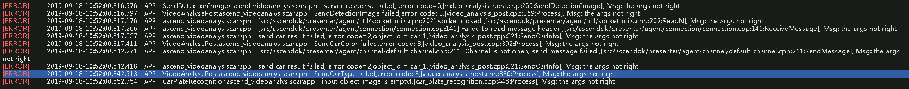
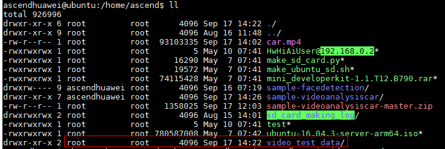

# What Do I Do If the Message "channel is not open, send message failed" Is Displayed When the Vehicle Detection Application Is Started?<a name="EN-US_TOPIC_0197325294"></a>

## Description<a name="section81419372249"></a>

After the vehicle detection application is deployed, the Presenter Server is started successfully, but no result is generated. The following error information is displayed in logs:

```
[ERROR]     2019-09-18-10:52:00.816.576APPSendDetectionImageascend_videoanalysiscarappserver
response failed, error code=6,[video_analysis_post.cpp:269:SendDetectionImage],
Msg: the args not right
[ERROR]    
2019-09-18-10:52:00.816.797APPVideoAnalysePostascend_videoanalysiscarappSendDetectionImage
failed,error code: 3,[video_analysis_post.cpp:369:Process], Msg: the args not
right
[ERROR]    
2019-09-18-10:52:00.817.176APPascend_videoanalysiscarapp[src/ascenddk/presenter/agent/util/socket_utils.cpp:202]
socket closed ,[src/ascenddk/presenter/agent/util/socket_utils.cpp:202:ReadN],
Msg: the args not right
[ERROR]    
2019-09-18-10:52:00.817.266APPascend_videoanalysiscarapp[src/ascenddk/presenter/agent/connection/connection.cpp:146]
Failed to read message header ,[src/ascenddk/presenter/agent/connection/connection.cpp:146:ReceiveMessage],
Msg: the args not right
[ERROR]    
2019-09-18-10:52:00.817.337APPascend_videoanalysiscarappsend car result
failed, error code=2,object_id =
car_1,[video_analysis_post.cpp:321:SendCarInfo], Msg: the args not right
[ERROR]     2019-09-18-10:52:00.817.411APPVideoAnalysePostascend_videoanalysiscarappSendCarColor
failed,error code: 3,[video_analysis_post.cpp:392:Process], Msg: the args not
right
[ERROR]    
2019-09-18-10:52:00.842.271APPascend_videoanalysiscarapp[src/ascenddk/presenter/agent/channel/default_channel.cpp:211]
Channel is not open, send message failed
,[src/ascenddk/presenter/agent/channel/default_channel.cpp:211:SendMessage],
Msg: the args not right
[ERROR]    
2019-09-18-10:52:00.842.418APPascend_videoanalysiscarappsend car result
failed, error code=2,object_id =
car_1,[video_analysis_post.cpp:321:SendCarInfo], Msg: the args not right
[ERROR]    
2019-09-18-10:52:00.842.513APPVideoAnalysePostascend_videoanalysiscarappSendCarType
failed,error code: 3,[video_analysis_post.cpp:380:Process], Msg: the args not
right
[ERROR]    
2019-09-18-10:52:00.852.754APPCarPlateRecognitionascend_videoanalysiscarappinput
object image is empty!,[car_plate_recognition.cpp:448:Process], Msg: the args
not right
```



## Cause Analysis<a name="section193448453285"></a>

Check the configuration of the Presenter Server, and find that the configuration is correct and the related library files are complete.

The postprocessing data fails to be sent, so it is suspected that the Mind Studio installation user has no write permission to the data storage path of the Presenter Server.

Check the permissions to the directories and files, and find that the write permission to the directory for storing data belongs to the  **root**  user group instead of the Mind Studio installation user.



## Solution<a name="section1748885062711"></a>

Change the permission group of the directory for storing data. The sample can run properly.

