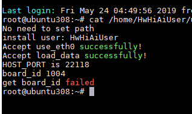

# What Do I Do If the Message "get board\_id failed" Is Displayed During the Online Upgrade of the Altas 200 DK Using Mind Studio?

## Description

When  Mind Studio  is used to upgrade the Atlas 200 DK online, the system displays the failure message  **check board\_id failed to upgrade Mini...**. The upgrade log file  **/home/HwHiAiUser/upgradeMini.log**  prompts  **get board\_id failed**, as shown in  [Figure 1](#en-us_topic_0172159070_fig115991217131216).

**Figure  1**  Upgrade failure log information  

## **Possible Cause**

During the online upgrade, the background checks  **board\_id**  of the Atlas 200 DK. If the board ID of the Atlas 200 DK is changed or added, the ID verification will fail, resulting in an upgrade failure.

## Solution

Write  **board\_id**  of the Atlas 200 DK to the configuration file in  **\~/tools/scripts/upgradeMiniBoardId.conf**. During the upgrade, the system compares  **board\_id**  obtained from the background with that in the configuration file. If they are the same, the verification is successful and the upgrade is allowed.

For example:

As shown in  [Figure 1](#en-us_topic_0172159070_fig115991217131216), set  **board\_id**  to  **1004**, write this ID to the configuration file in  **\~/tools/scripts/upgradeMiniBoardId.conf**, and save the file. Then, perform the upgrade again.

