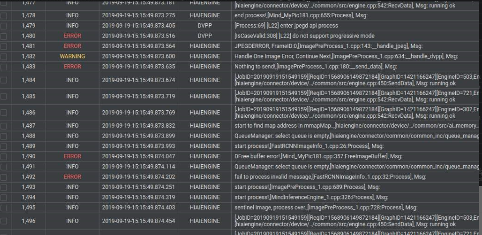

# What Do I Do If the Message Indicating That Progressive Encoding Is Not Supported Is Displayed During DVPP Running?

## Description

DVPP reports "not support progressive mode", as shown in  [Figure 1](#fig1944912370112).

**Figure  1**  Error example  

## Solution

The DVPP hardware does not support progressive encoding. Therefore, non-progressive encoding JPEG pictures are required. For details about progressive JPEG pictures, visit the following link:  [https://www.jianshu.com/p/e1b9d9aa9fc0](https://www.jianshu.com/p/e1b9d9aa9fc0)

For details about image formats supported by DVPP, see the  _DVPP API Reference_.

