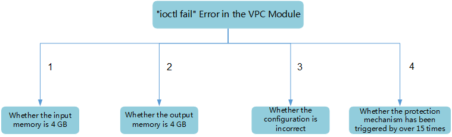
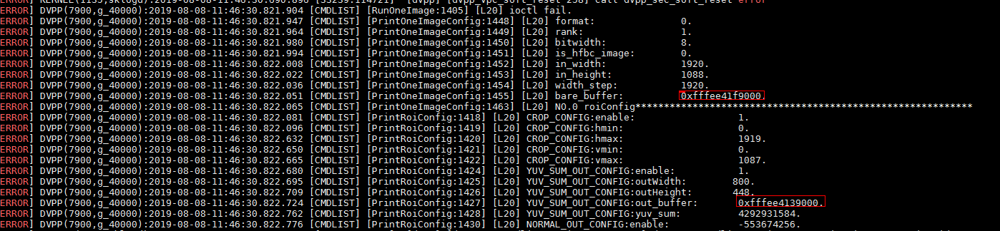
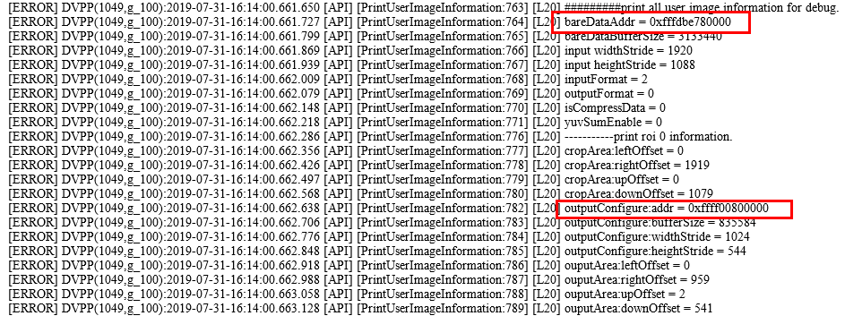
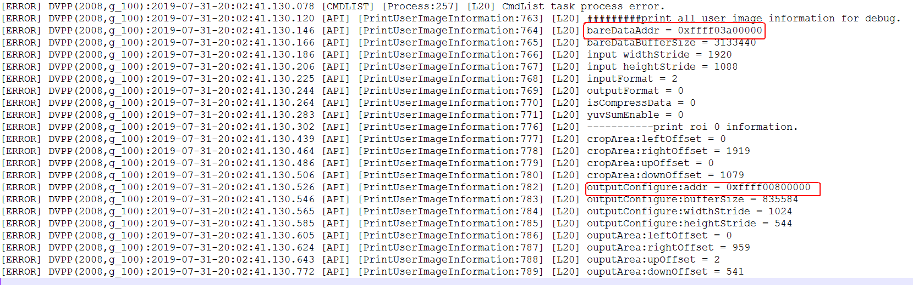
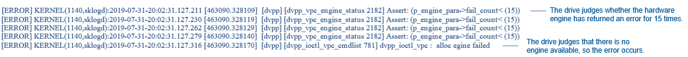

# What Do I Do If the Message "ioctl fail" Is Displayed When the VPC Function of DVPP Is Enabled?

## Overview

**ioctl**  is a processing interface for DVPP to invoke hardware. The ioctl failure error is the most common VPC error. Its causes can be classified into the following types:

**Figure  1**  Common causes of the ioctl fail error in the VPC  

## The Input or Output Memory Space Is Not 4 GB

**Error example**

-   If the input and output memory space is not 4 GB, the following information is displayed \(by the CMDLIST interface\):

    

-   If the input memory is not 4 GB but the output is memory is 4 GB, the following error information is displayed.

    

**Solution**

As required by DVPP, the virtual addresses of the input and output buffers of one task must be in the same 4 GB memory space. The virtual address of the 4 GB memory space provided by the Ascend 310 is  **0xffff00000000-0xffffffffffff**.

Allocate the memory by calling  **HIAI\_DVPP\_DMalloc**  and ensure that the width and height requirements \(128\*16 for C10 and 16\*2 for C30\) are met. In this way, the input and output are in the same 4 GB memory space.

A correct memory print log starts with  **0xffff**. Enter the memory printing keyword  **bare\_buffer**, and the output memory printing keyword  **outputConfigure:addr**  or  **YUV\_SUM\_OUT\_CONFIG:out\_buffer**.

The following figure shows the correct memory information in the 4 GB memory space.

## The Output Parameters Do Not Meet the VPC Requirements

-   The  _DVPP API Reference_  has specific restrictions on the VPC input and output memory, and clear code examples. Check whether each field is correct by referring to the  _DVPP API Reference_.
-   Requirements for input parameters vary with sub-functions, such as decompression, image cropping, and resizing. Configure the sub-functions according to the requirements of the  _Ascend 310 DVPP API Reference_, and perform programming by referring to the code examples in the document.
-   If an error is reported in the code designed by yourself, run the DVPP sample code in the DDK to check whether the development environment is faulty. If not, check the code design by referring to the DVPP sample code.

## The VPC Function Is Faulty for Multiple Times, Triggering the Hardware Protection Mechanism

The following information is displayed.

If the keyword  **p\_engine\_para-\>fail\_count< \(15\)**  is displayed, it means that the hardware protection mechanism is triggered because parameters or addresses are incorrectly entered for multiple times during the commissioning. In this case, the VPC interface cannot be called even if the calling is correct. You need to restart the system. This problem does not occur during normal service running.

Note: You are advised to restart the system before starting to test the overall service performance. Otherwise, the protection mechanism may be triggered, isolating some components \(four VPCs in total\). If one to three VPCs are isolated, services can still run properly, and the preceding error does not occur. However, the maximum running performance cannot be achieved. If 16-channel decoding is used, VPC decompression may fail to achieve the maximum performance in subsequent service tests due to the commissioning in the early stage.

