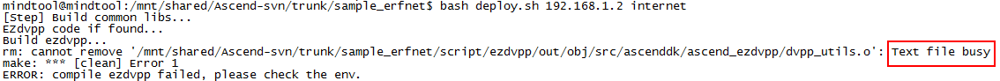

# What Do I Do If the Message "textfile busy" Is Displayed?<a name="EN-US_TOPIC_0197288419"></a>

## Description<a name="section89271248174116"></a>

The following error information is displayed during the application execution.

**Figure  1**  Example of the textfile busy error<a name="fig14778104424213"></a>  


## Solution<a name="section145643123518"></a>

The textfile busy error occurs because the file is occupied by another process.

1.  Run the  **fuser **command to check the ID of the process that uses the file.

    ```
    [root@localhost]# fuser < program file name >
    < program file name >: 50340
    ```

2.  Stop the process that uses the file.

    ```
    [root@localhost]# kill -9 50340
    ```


