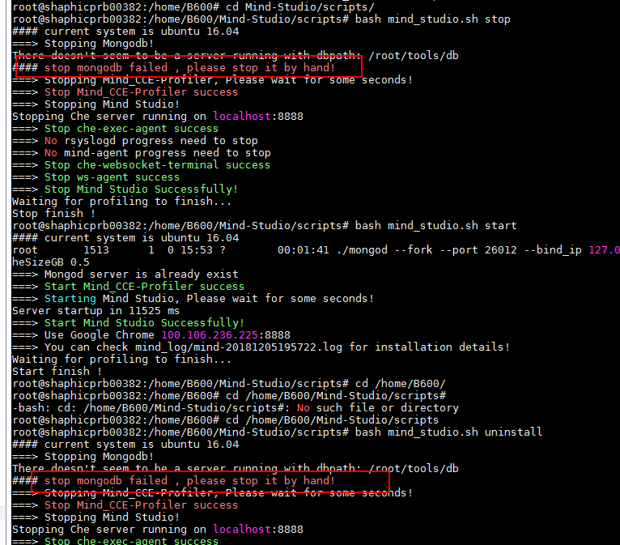

# What Do I Do If the MongoDB Service Fails to Be Stopped During Uninstallation?

## Symptom

During the uninstallation, the MongoDB service fails to be stopped due to abnormal operations \(for example, manually deleting database files\), as shown in  [Figure 1](#en-us_topic_0160789093_fig1147210535611).

**Figure  1**  MongoDB service stop failure during the uninstallation  

## Solution

You can run the  **kill**  or  **pkill**  on Linux to forcibly stop the MongoDB, for example,  **pkill mongodb**. Then, uninstall MongoDB.

