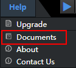
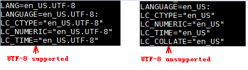

# What Do I Do If the Online Help Documents Fail to Be Viewed?<a name="EN-US_TOPIC_0196221398"></a>

## Symptom<a name="en-us_topic_0160789083_section122882019289"></a>

After installing  Mind Studio  on the Linux server, choose  **Help \> Documents**  as shown in  [Figure 1](#en-us_topic_0160789083_fig7405173719218). The online help page is displayed. The content cannot be refreshed after a directory is clicked.

**Figure  1**  Navigation path for online help<a name="en-us_topic_0160789083_fig7405173719218"></a>  


## Solution<a name="en-us_topic_0160789083_section14679193632817"></a>

Run the  **locale**  command to check whether the Linux server supports the UTF-8 character set, as shown in  [Figure 2](#en-us_topic_0160789083_fig7981820122910). The following solutions are provided for the two situations.

**Figure  2**  Viewing the character set<a name="en-us_topic_0160789083_fig7981820122910"></a>  


1.  If the Linux server does not support the UTF-8 character set:

    To install the UTF-8 character set, perform the following steps:

    1.  Run the  **vi**  command to open the  **/etc/default/locale**  file and change the content to the following:

        ```
        LANG="en_US.UTF-8"
        LANGUAGE="en_US.UTF-8"
        ```

        Run the  **:wq!**  command to save the file and exit.

    2.  Run the following command:

        ```
        locale-gen -en_US:en
        ```

        If an error is reported after this command is executed, ignore it and go to Step 2 directly.

    3.  Run the following command to restart the server:

        ```
        reboot
        ```

2.  If the Linux server supports the UTF-8 character set:

    In the directory where the online help documents are located, for example,  **:\~tools/Mind-Studio-5.22.0/tomcat/webapps**, run the following command:

    ```
    convmv -f gb2312 -t UTF-8 --nosmart --notest -r docs
    ```


