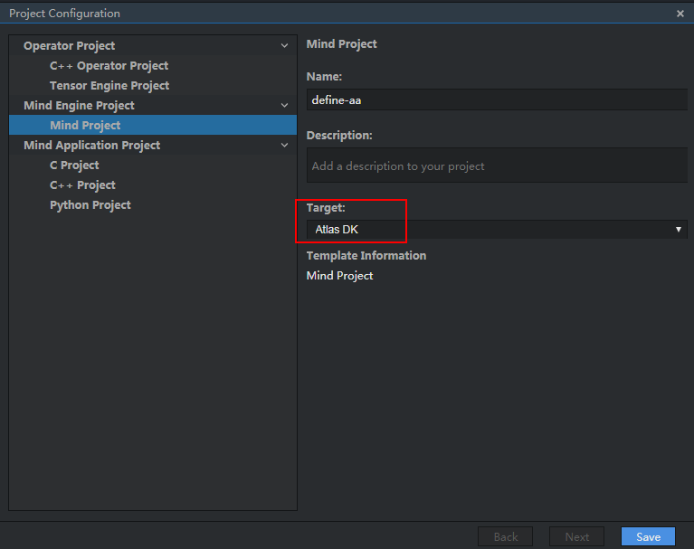

# What Do I Do If the Running of the Orchestration Process Fails?<a name="EN-US_TOPIC_0196221412"></a>

## Symptom<a name="section159431714376"></a>

During the running of the orchestration process, the following error information is displayed:

-   CreateGraph init failed
-   can't connect the remote host...
-   no result file generated
-   remote\_open failed, sock-1

    remote\_handle failed, err -1


...

## Solution<a name="section387761017451"></a>

Perform the following steps:

1.  Check whether the project type is  **Atlas DK**.

    Select a project, choose  **File**  \>  **Project Configuration**, and check whether  **Target**  of the project is  **Atlas DK**.

    **Figure  1**  Viewing the project type<a name="fig627923912418"></a>  
    

    If the project type is  **Atlas DK**, go to  [2](#li8588481151). 

    If the project type is not  **Atlas DK**, change the project type.

2.  <a name="li8588481151"></a>Check the network connection between  Mind Studio  and the Atlas DK developer board.

    On the  Mind Studio  server, run the  **ping  _192.168.1.2_**  command to check whether  Mind Studio  is connected to the developer board.

    If  Mind Studio  is successfully connected to the developer board, go to  [3](#li12458243151713).

    If the connection is abnormal, check it by referring to  _Ascend 310 Atlas 200 Developer Kit User Guide_.

3.  <a name="li12458243151713"></a>Check whether the date on the developer board is consistent with that on  Mind Studio.

    Check whether the date on the developer board is consistent with that on  Mind Studio.

    Run the  **date**  command on the  Mind Studio  server and developer board respectively to check whether the dates are the same.

    If the dates are the same, go to  [4](#li936515332313).

    If the dates are inconsistent, run the  **date -s  _01/16/2019_**  command to change them to be the same.

4.  <a name="li936515332313"></a>Check whether the  **resize**  value of the image pre-processing node in the orchestration process is the same as that required by the model.

    You can use either of the following methods to view the required image size of the network model:

    -   When importing a network model to  Mind Studio, obtain the height and width required by the model based on the parameters listed in  [Figure 2](#en-us_topic_0150461308_fig156634962714).

        **Figure  2**  Model import example<a name="en-us_topic_0150461308_fig156634962714"></a>  
        

        The values of  **H**  and  **W**  shown in the preceding figure are the required height and width of the image to be processed by the imported model.

    -   Check the  **input\_param**  parameter in the .prototxt file of the network model.

        ```
        layer {
          name: "input"
          type: "Input"
          top: "data"
          input_param {
            # These dimensions are purely for sake of example;
            # see infer.py for how to reshape the net to the given input size.
            shape { dim: 1 dim: 3 dim: 500 dim: 500 }
          }
        }
        ```

        In the preceding information, the last two parameters of  **shape**  in  **input\_param**  are the height and width required by the model, respectively.

    Set the height and width of the  **Resize**  attribute of the ImagePreProcess node to the height and width required by the preceding model.

5.  After checking the preceding configurations, run the orchestration process again.

