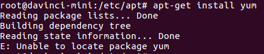

# What Do I Do If the Software Installation Using the apt-get Command Fails After the Developer Board Is Connected to the Network?<a name="EN-US_TOPIC_0196221448"></a>

## Symptom<a name="section1268235753516"></a>

After the network is configured for the developer board by referring to  [How Do I Configure the Developer Board to Connect to the Network Through the Mind Studio Server in USB Connection Mode?](how-do-i-configure-the-developer-board-to-connect-to-the-network-through-the-mind-studio-server-in-u.md), the following error information is displayed when the  **apt-get install  _xxx_**  command is executed on the developer board to download software:



## Solution<a name="section1354218297365"></a>

The Ubuntu sources may be incorrectly configured. The developer board runs on Ubuntu \(ARM\). It requires different sources from that of Ubuntu \(x86\). Therefore, you need to modify the  **/etc/apt/sources.list**  file.

1.  Back up the  **sources.list**  file.

    **sudo cp /etc/apt/sources.list /etc/apt/sources.list.bak**

2.  Open the  **sources.list**  file, replace the content with the following sources, save the file, and exit.

    ```
    deb http://mirrors.aliyun.com/ubuntu-ports/ xenial main
    deb-src http://mirrors.aliyun.com/ubuntu-ports/ xenial main
    deb http://mirrors.aliyun.com/ubuntu-ports/ xenial-updates main
    deb-src http://mirrors.aliyun.com/ubuntu-ports/ xenial-updates main
     deb http://mirrors.aliyun.com/ubuntu-ports/ xenial universe
    deb-src http://mirrors.aliyun.com/ubuntu-ports/ xenial universe
    deb http://mirrors.aliyun.com/ubuntu-ports/ xenial-updates universe
    deb-src http://mirrors.aliyun.com/ubuntu-ports/ xenial-updates universe
    deb http://mirrors.aliyun.com/ubuntu-ports/ xenial-security main
    deb-src http://mirrors.aliyun.com/ubuntu-ports/ xenial-security main
    deb http://mirrors.aliyun.com/ubuntu-ports/ xenial-security universe
    deb-src http://mirrors.aliyun.com/ubuntu-ports/ xenial-security universe
    ```

3.  Run the  **sudo apt-get update**  command to update the sources.

    Then, you can run the  **apt-get install**  command to install the required software.


