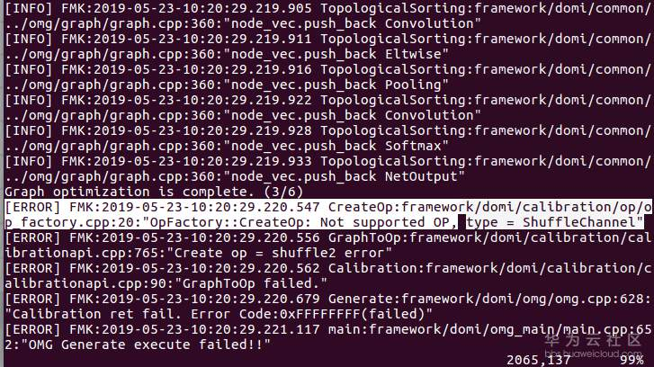

# What Do I Do When 8-Bit Quantization Cannot Be Performed During the ShuffleNet Model Conversion?<a name="EN-US_TOPIC_0196221447"></a>

## Symptom<a name="section18283125141816"></a>

ShuffleNet model conversion fails after 8-bit quantization is selected. The  **convertModel.log**  file reports the following error:

```
[ERROR] FMK:2019-05-23-10:20:29.220.547 CreateOp:framework/domi/calibration/op/op_factory.cpp:20:"OpFactory::CreateOp: Not supported OP, type = ShuffleChannel"
```

For details, see the following figure.

**Figure  1**  Model conversion failure log<a name="fig119421438112118"></a>  


## Solution<a name="section1582968182211"></a>

The shuffleChannel operator in the ShuffleNet model does not support quantization.

The shuffleChannel operator can be added to the blacklist by using the  **exclude\_op**  option only when the operator supports quantization.

Currently, only the Convolution, Full Connection, and ConvolutionDepthwise operators support quantization.

