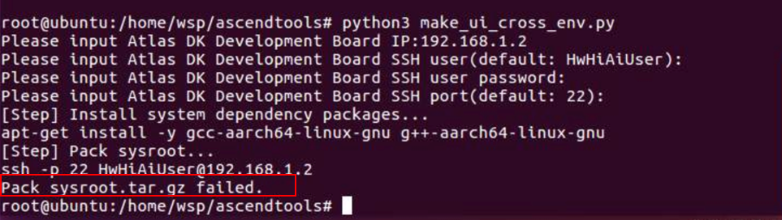
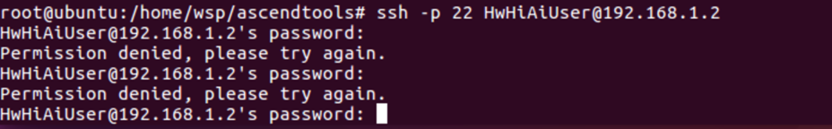
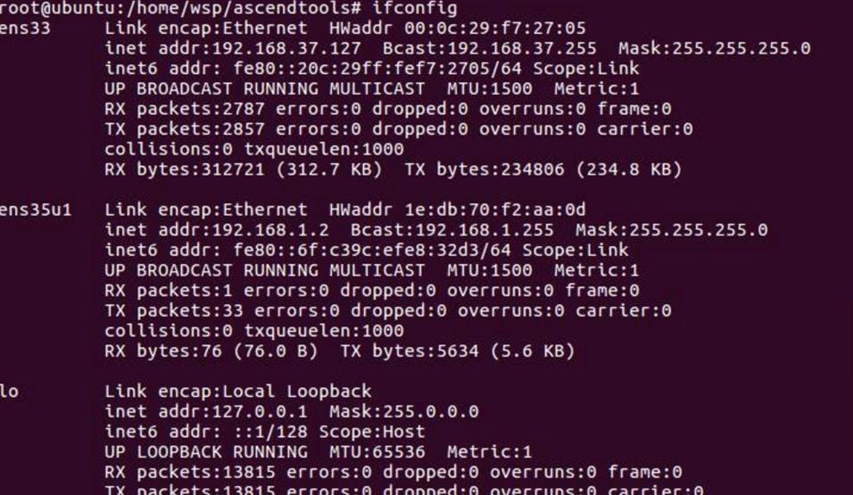

# What Do I Do When the Message"Pack sysroot.tar.gz failed" Is Displayed During the Configuration of a Cross Compilation Environment?

## Description

During the configuration of a cross compilation environment, the message "Pack sysroot.tar.gz failed" is displayed, as shown in the following figure.

**Figure  1**  Cross compilation environment configuration failure  

The command output shows that an error occurs after logging in to the developer board in SSH mode. In this case, run the  **ssh -p 22 HwHiAiUser@192.168.1.2**  command and enter the default password  **Mind@123**. The message "Permission Denied" is displayed.

**Figure  2**  Login failure  

## Solution

1.  If the login to the developer board from the server in SSH mode where  Mind Studio  is located fails, check the IP address of the  Mind Studio  server, as shown in the following figure.

    **Figure  3**  Checking the IP address of the server where  Mind Studio  is located  
    

    As shown in the preceding figure, the IP address of the USB virtual network interface card \(NIC\) is the same as that of the developer board. Therefore, the IP address of the USB NIC needs to be changed to  **192.168.1.**_x_.

2.  Connect the PC to the developer board using a router and change the IP address of the router to an IP address that is in the same network segment as the developer board \(192.168.1.x\).

