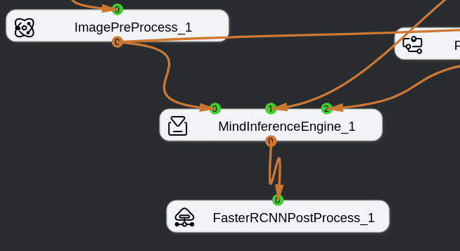

# What is InputSize in the Engine Implementation Code?<a name="EN-US_TOPIC_0197299667"></a>

## Description<a name="section6379113312017"></a>

The C++ code of each engine has the following macro definition:

```
HIAI_IMPL_ENGINE_PROCESS("face_register", FaceRegister, INPUT_SIZE)
```

What does  **INPUT\_SIZE**  mean?

## Solution<a name="section846891176"></a>

The  **engine.h**  file has the following definitions:

```
#define HIAI_IMPL_ENGINE_PROCESS(name, engineClass, inPortNumInput) \
HIAI_REGISTER_ENGINE_UNIQUE(name, engineClass, __COUNTER__)         \
HIAI_StatusT engineClass::Process(HIAI_INPUT_ARGS(inPortNumInput))
```

**INPUT\_SIZE**  indicates the number of input ports.

For details, see the following figure.

**Figure  1**  Engine orchestration instance<a name="fig1349312106914"></a>  


-   The  **INPUTSIZE**  value of MindInferenceEngine\_1 is  **3**.
-   The  **INPUTSIZE**  value of FasterRCNNPostProcess\_1 is  **1**.

