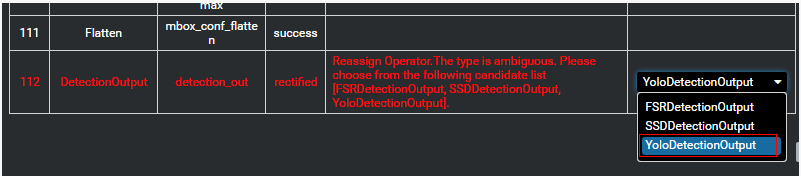

# What Is the Meaning of DetectionOuput During Model Conversion on the GUI?

During model conversion on  Mind Studio, the following dialog box may be displayed.

In this case, you need to select an operator from the drop-down list box in the rightmost column based on the specific network.

The definition of the DetectionOutput operator varies according to the network models. Even if a model file contains the DetectionOutput operator, the OMG fails to determine the DetectionOutput operator of the correct network model for model conversion. Therefore, the DetectionOutput operator must be manually selected based on the actual network model, that is, the OMG renames the operator internally based on the actual situations.

