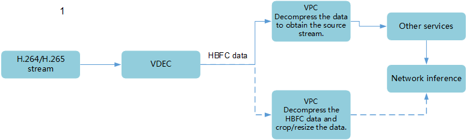

# Why is the HFBC Format Required for the VDEC of DVPP?

## Analysis

The video decoder \(VDEC\) outputs data in Hisi Frame Buffer Compress \(HFBC\) format to reduce the bandwidth for writing data to the memory. Then the VPC module decompresses the HFBC data. The VDEC and VPC module are independent from each other.

## Advantages of the HBFC format

The following figure shows the data processing procedure.

-   After obtaining data in HFBC format from the VDEC, you can call the VPC module to resize or crop the data. For example, resize or crop the obtained HFBC data \(1920\*1080\) to YUV data \(224\*224\). The resizing or cropping operation is performed according to the configuration parameter, and is relatively flexible. You only need to call the VPC module once, ensuring high performance, as the dotted line in the preceding figure.
-   If you need the source image, the HBFC format is not helpful, but does not affect the service functions at all.

